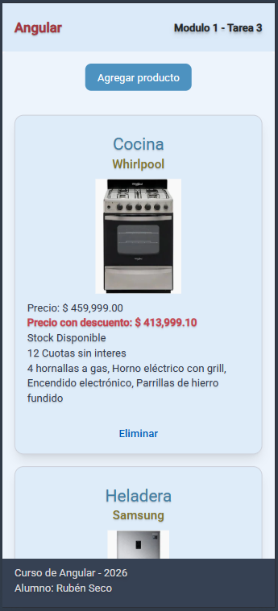
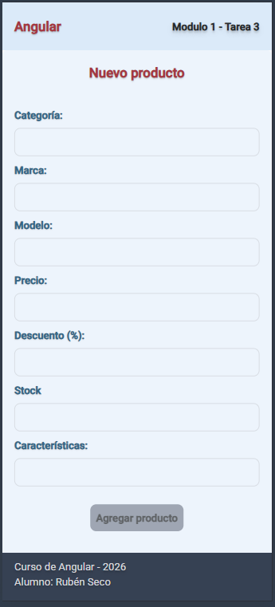
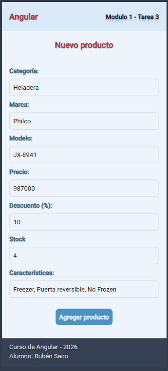
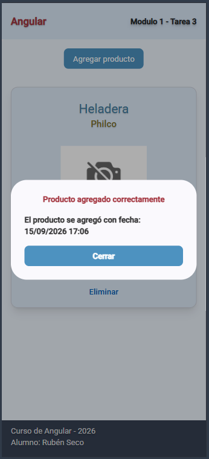
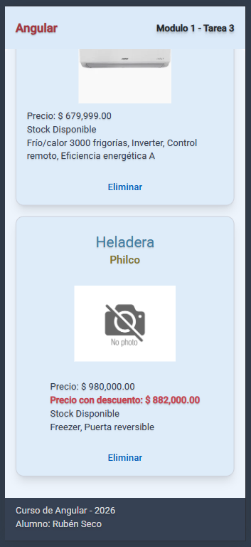
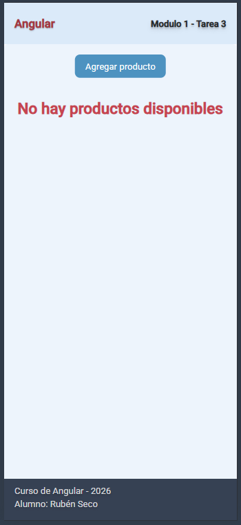

# Diplomatura en Profesional Full-Stack Developer

## Curso de desarrollo con Angular - Profesor: Gabriel Alberini

### Módulo 1: Angular

### Unidad 3: Angular intermedio. Servicios.

### Tarea 3: Gestión y visualización de datos con _pipes_.

### Objetivos:

Aplicar el concepto de **servicio** en Angular para manejar datos desde una API (simulada o real).
Utilizar **pipes** estándar y personalizados para transformar información antes de presentarla.

### Consideraciones:

- Se simula la dinámica de datos cargando los datos estáticos en una señal que es un arreglo del tipo IProduct.

- Cada vez que se recarga la página, se actualiza la señal con los datos estáticos.

- Las señales se utilizan en Angular como variables de contexto.

- Se podrían guardar los datos en el localStorage para simular persistencia de datos.
  Pero no es el objetivo de la tarea. No es parte de la consigna.

- Se agrega una imagen genérica al nuevo producto para simplificar el código.
  Agregar una imagen adecuada no es parte de la consigna.

- El formulario y el diálogo se obtienen de Angular Material.

### Capturas de pantallas:

- El pipe **CurrencyPipe** se aplica en el componente de lista de productos para mostrar el precio de los productos y el precio con descuento.

- El pipe **DatePipe** se aplica en el componente de diálogo que aparece cuando se agrega un nuevo producto para mostrar la fecha de creación del producto.

- El custom pipe **DiscountPipe** se aplica en el componente de lista de productos para mostrar el precio con descuento de los productos.

| Lista de productos                                                          | Formulario de producto                                   | Datos del producto en el formulario                                        |
| --------------------------------------------------------------------------- | -------------------------------------------------------- | -------------------------------------------------------------------------- |
|                             |  |  |
| Formulario completado y enviado con éxito                                   | Nuevo producto agregado                                  | Productos eliminados                                                       |
|  |  |                  |

### Como ejecutar la tarea:

1. Clonar el repositorio:

```bash
git clone https://github.com/Diplomatura-Full-Stack-Developer/Angular-M1-T3

```

1. Instalar las dependencias:

```bash
npm install
```

1. Ejecutar la aplicación:

```bash
ng serve
```

### Recursos utilizados:

- Angular ([https://angular.dev/](https://angular.dev/))
- Angular CLI - Versión 22.1.7 ([https://angular.io/cli](https://angular.io/cli))
- Node.js - Versión 24.20.0 ([https://nodejs.org/es/download/](https://nodejs.org/es/download/))
- Tailwind CSS - Versión 4.1.12 ([https://tailwindcss.com/](https://tailwindcss.com/))
- Angular Material - Versión 22.1.5 ([https://material.angular.io/](https://material.angular.io/))

### Alumno: Rubén Seco

### Comisión: 181802
